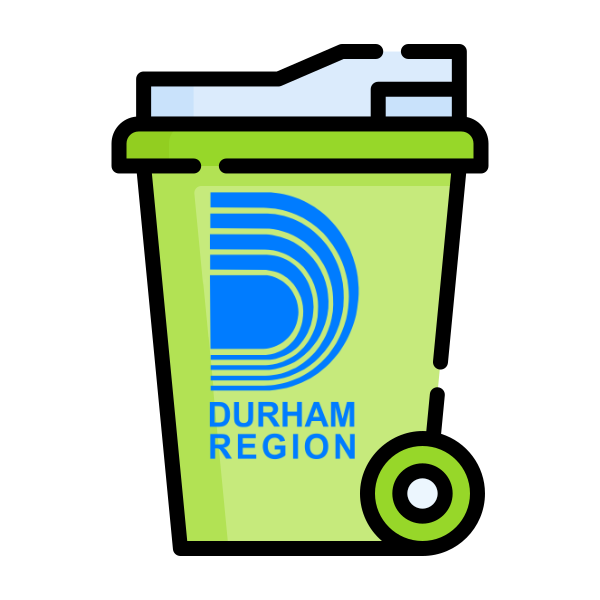

# trmnl-next-pickup-plugin
Plugin for next pickup day for Durham Region, Ontario, Canada 🇨🇦

| 🖼️ | 🖼️ |
| ----- | ---- | 
|  |   | 
|  |  |

### Setup

https://hossain-khan.github.io/trmnl-next-pickup-plugin/

## Documentations
- https://help.usetrmnl.com/en/articles/9510536-private-plugins
- https://usetrmnl.com/framework
- https://help.usetrmnl.com/en/articles/10671186-liquid-101
- https://www.durham.ca/en/living-here/collection-calendar.aspx
