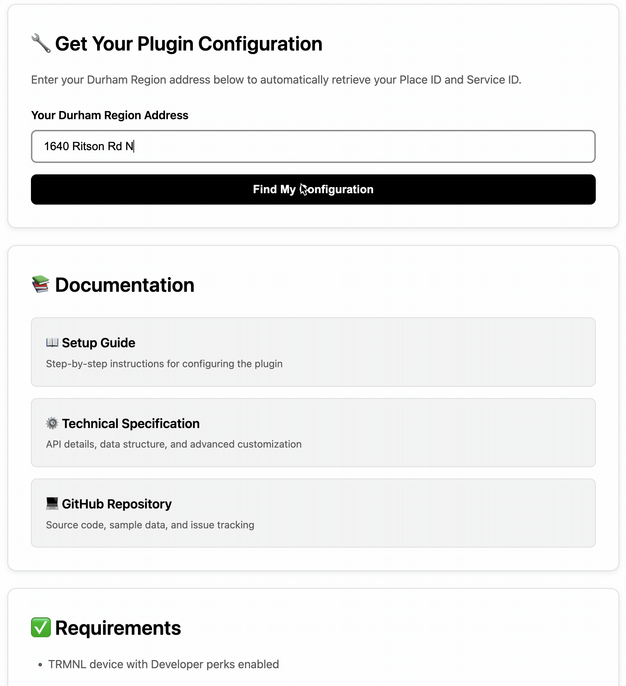

# Durham Waste Collection - TRMNL Plugin Recipe

Never miss your garbage, recycling, or green bin pickup day! This plugin displays your Durham Region collection schedule directly on your TRMNL e-ink display.

---

## 🚀 Quick Setup (2 Steps)

### Step 1: Install or Fork the Recipe

Visit the TRMNL platform and install the Durham Waste Collection recipe:

👉 **[Durham Waste Collection Recipe](https://usetrmnl.com/recipes)** (search for "Durham Waste")

**Choose your approach:**
- 🔹 **Install** - 1-click setup, receives automatic updates (recommended for most users)
- 🔹 **Fork** - Fully customizable markup and settings, no automatic updates (requires [Developer edition](https://usetrmnl.com/blog/developer-edition))

> 💡 **Tip:** Start with Install. You can always Fork later if you want to customize the look and feel!

---

### Step 2: Get Your Configuration Values

Use our **Configuration Helper** to automatically find your Place ID:

👉 **https://hossain-khan.github.io/trmnl-next-pickup-plugin/**

1. Enter your Durham Region address
2. Click "Find My Configuration"
3. Copy the three values (Place ID, Service ID, Display Address)
4. Paste them into the recipe's configuration form on TRMNL

---

## ✨ What You Get

- 🗓️ **Real-time Updates** - Automatic polling from Durham Region API
- ♻️ **All Collection Types** - Blue Box, Green Bin, Garbage, Yard Waste, seasonal items
- 📱 **Multiple Layouts** - Full, Half, Quarter, and Third view sizes
- 🎨 **Beautiful Icons** - Visual indicators for each collection type
- ⏰ **Countdown Display** - Shows days until next pickup
- 🔄 **Automatic Updates** - Installed recipes receive bug fixes and improvements automatically

---

## 🎨 Customization (Optional)

If you **Forked** the recipe, you can customize:
- Layout and styling (font sizes, spacing, colors)
- Which collection types to display
- Time range (default: next 30 days)
- Display address formatting

Visit the [Configuration Helper](https://hossain-khan.github.io/trmnl-next-pickup-plugin/) for markup templates for all view sizes.

---

## 📋 Requirements

- TRMNL device
- Durham Region, Ontario address
- Place ID from Recollect (use our [Configuration Helper](https://hossain-khan.github.io/trmnl-next-pickup-plugin/))
- [Developer edition add-on](https://usetrmnl.com/blog/developer-edition) (only if you want to Fork and customize)

---

## 🆘 Need Help?

- **Configuration Helper:** https://hossain-khan.github.io/trmnl-next-pickup-plugin/
- **Manual Setup Guide:** [PLUGIN_SETUP_GUIDE.md](resources/PLUGIN_SETUP_GUIDE.md) (for advanced users building from scratch)
- **Technical Specification:** [TECHNICAL_SPECIFICATION.md](resources/TECHNICAL_SPECIFICATION.md)
- **GitHub Issues:** [Report a problem](https://github.com/hossain-khan/trmnl-next-pickup-plugin/issues)

---

## 🎉 That's It!

Your recipe is ready! It will automatically refresh based on your playlist schedule and always show your next pickup date.

**Pro Tip:** Set your TRMNL to refresh early morning (e.g., 6 AM) so you always see current info before pickup day!

---

## 📚 About Recipes

**Install vs Fork:**
- **Installed recipes** receive automatic updates (bug fixes, markup improvements) but cannot be modified
- **Forked recipes** can be customized completely but do not receive updates from the creator

For less technical users, we suggest Installing. For developers who want full control, Fork the recipe and modify as needed!

Learn more: [TRMNL Plugin Recipes Guide](https://help.usetrmnl.com/en/articles/10122094-plugin-recipes)

---

Made with ❤️ for [TRMNL](https://usetrmnl.com) | [View on GitHub](https://github.com/hossain-khan/trmnl-next-pickup-plugin)
